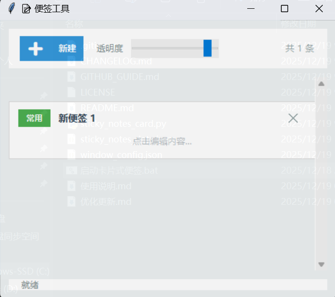

# 📝 置顶便签工具 (Sticky Notes Tool)

[](https://www.python.org/)
[](LICENSE)
[](#)

一个简洁、美观、高效的桌面便签应用，专为**频繁跨文档数据填写**的办公场景设计。基于 Python + Tkinter 开发，无需复杂依赖，即开即用。

---

## ✨ 核心特性

### 🎯 办公痛点解决
- **始终置顶 (Always on Top)**：在进行 Excel 录入或网页表单填写时，便签窗口始终浮于最上方，无需频繁 `Alt+Tab` 切换。
- **一键复制 (Click-to-Copy)**：集成复制按钮，点击即可将预设内容存入剪贴板，极大提升填写效率。
- **自动保存**：编辑即保存，意外关闭也不怕数据丢失。

### 🎨 现代化 UI 设计
- **卡片式布局**：借鉴现代网页设计，信息呈现层次分明。
- **彩色分类标签**：预设常用、地址、电话、邮箱、账号等 6 种配色，数据归类一目了然。
- **透明度调节**：支持窗口半透明，不遮挡底层文档视线。
- **响应式缩放**：自动适应窗口大小，支持字体智能调整。

### ⚡ 快捷操作
- `Ctrl + N`：新建便签
- `Ctrl + C`：复制内容
- `Ctrl + Q`：快速退出
- **窗口记忆**：自动记录上次关闭时的位置和大小。

---

## 📸 应用截图

*(建议在此处上传截图到 GitHub 仓库后替换下方链接)*


---

## 🚀 快速开始

### 环境要求
- **Python**: 3.6 或更高版本。
- **操作系统**: Windows (最佳体验) / macOS / Linux。

### 安装与运行

1. **克隆项目**
```bash
git clone [https://github.com/lingfeng1983/Alen.git](https://github.com/lingfeng1983/Alen.git)
cd Alen
运行程序

Windows: 直接双击运行 启动卡片式便签.bat 或执行 python sticky_notes_card.py。

macOS/Linux: 在终端执行 python3 sticky_notes_card.py。

提示：Linux 用户如遇图形界面报错，请运行 sudo apt-get install python3-tk。

📖 典型使用场景
政务/财务录入：将繁杂的项目编号、纳税人识别号暂时存放在便签中，随时点击复制。

客服话术：存放常用语，快速回复客户咨询。

临时备忘：会议中记录突发想法或待办事项。
🛠️ 项目结构
Plaintext

Alen/
├── sticky_notes_card.py    # 主程序逻辑
├── 启动卡片式便签.bat       # Windows 快速启动脚本
├── .gitignore             # Git 忽略配置（排除本地数据）
├── README.md              # 项目说明文档
└── LICENSE                # MIT 开源许可证
🤝 贡献与反馈
如果你有任何建议、发现了 Bug，或者想要添加新功能，欢迎：

提交 Issues

发送 Pull Request

联系作者：uplearning1983@gmail.com

📄 许可证
本项目采用 MIT License。您可以自由地使用、修改和分发本软件。

如果这个小工具帮到了你，请点一个 ⭐ Star，这是对我最大的支持！

<p align="center">Made with ❤️ by <a href="https://github.com/lingfeng1983">lingfeng1983</a></p>
